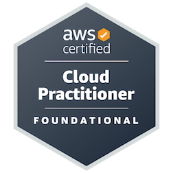

## Hi there 👋

<!--
**Banudeep/Banudeep** is a ✨ _special_ ✨ repository because its `README.md` (this file) appears on your GitHub profile.

Here are some ideas to get you started:

- 🔭 I’m currently working on ...
- 🌱 I’m currently learning ...
- 👯 I’m looking to collaborate on ...
- 🤔 I’m looking for help with ...
- 💬 Ask me about ...
- 📫 How to reach me: ...
- 😄 Pronouns: ...
- ⚡ Fun fact: ...
-->

<h1 align="center">Hi 👋, I'm Banudeep Reddy Gade</h1>
<h3 align="center">Software Engineer | Cloud & Backend Developer</h3>

<p align="center">
  Passionate about building scalable, secure applications using cloud-native tools.
  <br>
  <a href="https://banudeep.github.io/Portfolio/">🌐 Portfolio</a> • 
  <a href="https://www.linkedin.com/in/banudeep-reddy-gade-118013212/">💼 LinkedIn</a>
</p>

---

## 🏆 Certifications
<p align="left">
  <a href="https://www.credly.com/badges/cffbe700-be16-43d2-8064-feaeafb229a0/public_url">
    
  </a>
  <a href="https://www.credly.com/badges/55cb038c-32db-43f5-a672-440b0b4da63b/public_url">
    
  </a>
</p>

---

## 🛠️ Tech Stack

```bash
Languages: Python, Java, JavaScript, SQL  
Cloud: AWS, GCP, Terraform  
Frameworks: Spring Boot, Flask, FastAPI, React  
Tools: Docker, Kubernetes, GitHub Actions, Jenkins  
